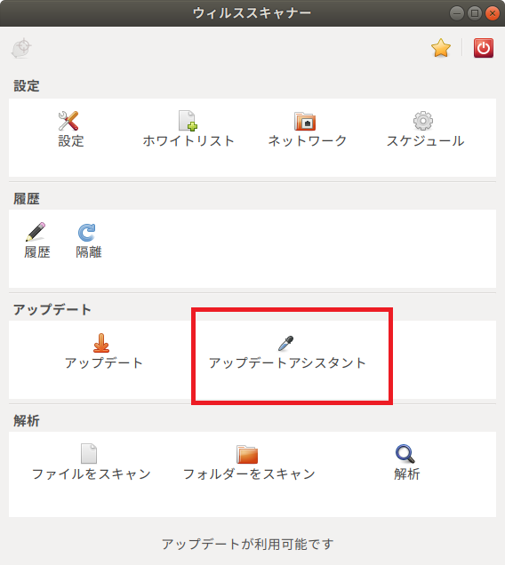
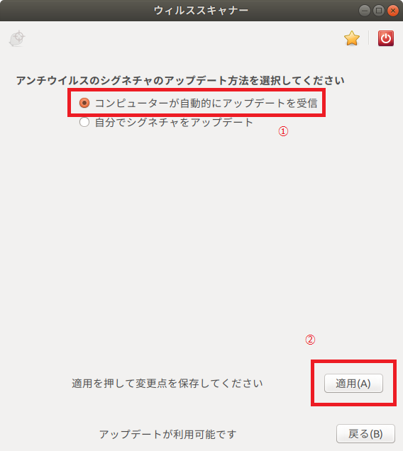
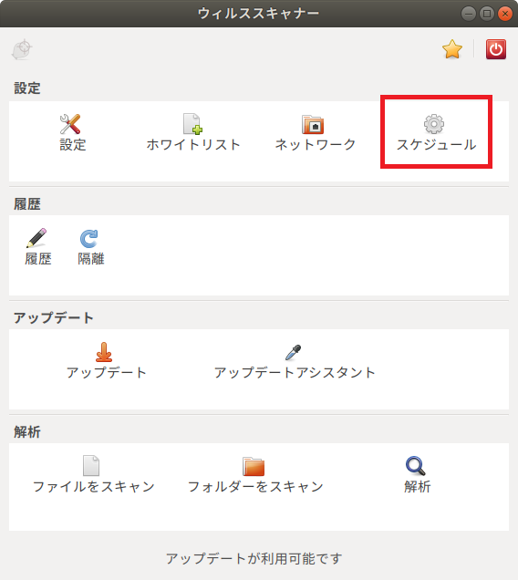
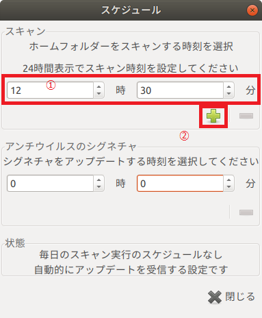

# ウイルス・スキャン・アプリの導入

セキュリティ対策として、無料で使用できるウイルス・スキャン・アプリ**ClamTK**の導入方法をまとめる。

## ClamTKの導入

**ClamTK**は、以下のように`apt install`で導入できる。

~~~bash
$ sudo apt install clamtk clamtk-gnome libclamunrar7
~~~

## スケジュールスキャンの設定

スケジュール・スキャンは、

- アプリケーションのスケジュール設定
- デスクトップ・エントリ・ファイルの修正

の2段階で設定が必要になる。以下、その手順を記す。

### アプリケーションの設定

1. **ClamTK**を起動したら、[アップデートアシスタント]を選択する。

2. [コンピュータが自動的にアップデートを受信]を選択して、[適用]ボタンをクリックする。

3. **ClamTK**のトップ画面に戻り、[スケジュール]を選択する。

4. スキャンを開始する時刻を設定し、[+]ボタンをクリックする。

### デスクトップ・エントリ・ファイルの修正

合わせて、デスクトップ・エントリ・ファイル`/usr/share/applications/clamtk.destop`を以下のように修正する。

~~~sh
× : Exec=clamtk %F
○ : Exec=env LC_TIME=C clamtk %F
~~~

これで、再起動後にスケジュールスキャンが有効になる。

